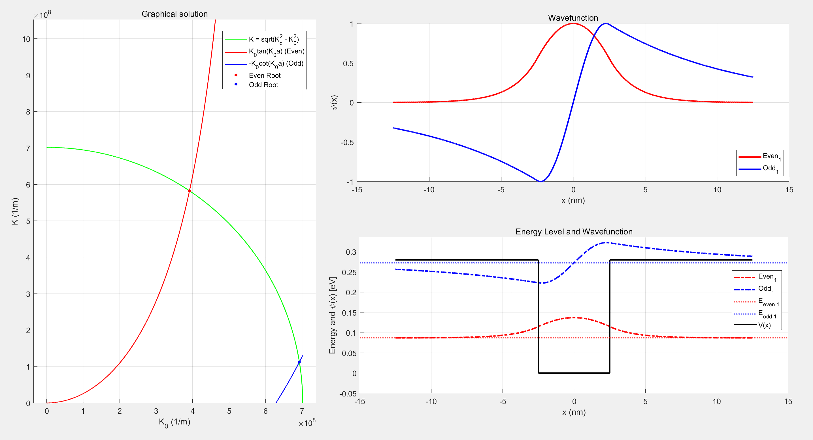
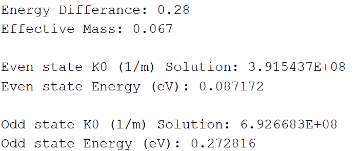
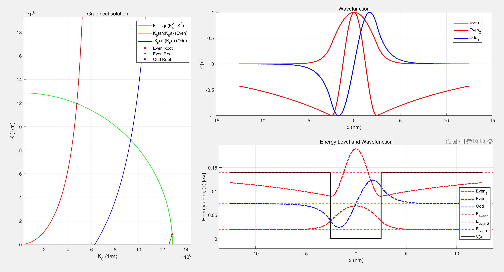
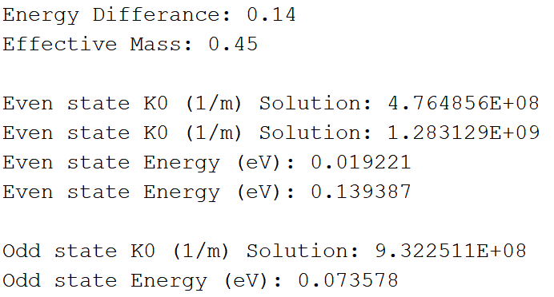

# HW1-결과 해석
## I. 결과
### 1. Electron

- $V_0$: 0.28 eV
- Effective mass $m$: 0.067$m_0$

시뮬레이션 결과, 전자의 경우 Even에서 1개, Odd에서 1개, 총 두개의 에너지 레벨이 존재한다.

- **Even**: 0.0872 eV
- **Odd**: 0.2728 eV

그래프상에서 우물 내부에서는 파동함수가 진동하고 외부에서는 지수적으로 감쇠하는 유한 포텐셜 우물의 특징을 보인다. 전자의 낮은 Effective mass로 인해 비교적 큰 에너지 간격을 보이고 있다.

### 2. Hole

- $V_0$: 0.14 eV
- Effective mass $m$: 0.45$m_0$

시뮬레이션 결과, Hole의 경우 Even에서 2개, Odd에서 1개, 총 세개의 에너지 레벨이 존재한다.

- **Even1**: 0.0192 eV
- **Odd**: 0.0736 eV
- **Even2**: 0.1394 eV

그래프상에서 우물 내부에서는 파동함수가 진동하고 외부에서는 지수적으로 감쇠하는 유한 포텐셜 우물의 특징을 보인다. 전자의 낮은 Effective mass로 인해 비교적 큰 에너지 간격을 보이고 있다.

Hole는 전자에 비해 Effective mass이 크고 $V_0$가 작기 때문에 에너지 준위가 전자보다 빽빽한 형태를 보인다. 

전자와 마찬가지로 그래프상에서 우물 내부에서는 파동함수가 진동하고 외부에서는 지수적으로 감쇠하는 유한 포텐셜 우물의 특징을 보인다.